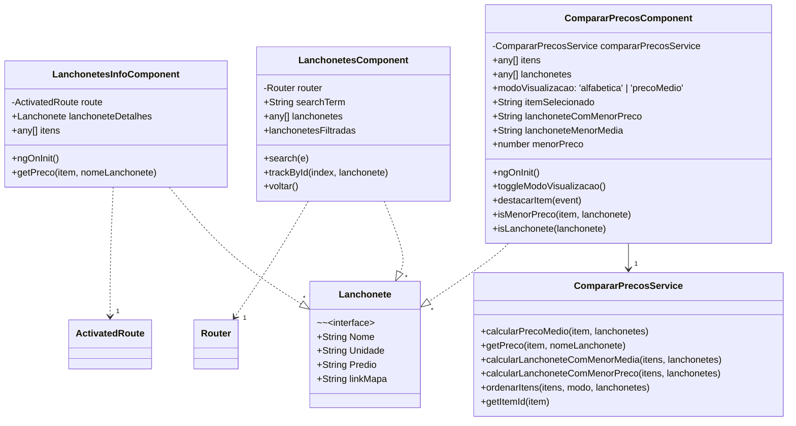
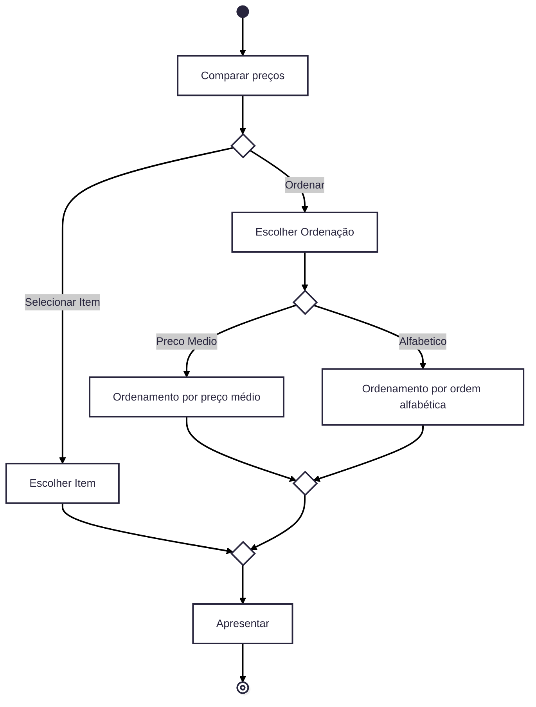

# Onde tem na UFMG

**Onde tem na UFMG** permite que os usuários visualizem todas as lanchonetes da UFMG, exibindo os itens e seus respectivos preços. Além disso, possibilita a comparação de preços entre produtos semelhantes de diferentes lanchonetes, facilitando a escolha mais econômica. Eventuais alterações nos valores dos itens podem ser informadas pela comunidade universitária, garantindo que as informações exibidas estejam sempre atualizadas.

## Funcionalidades
- Exibir todas as lanchonetes da UFMG.
- Exibir os itens e valores de cada lanchonete.
- Comparação de preço entre itens.
- Atualizar os valores conforme à alteração no preço dos itens.

 ## Integrantes
- Lucas Momede Barreto Rezende - Fullstack
- Luiza Sodré Salgado - Fullstack
- Vinícius de Oliveira Marcos - Fullstack
- Wilian Ventura dos reis - Fullstack
  
## Tecnologias
- Frontend: Angular
- Backend: TypeScript
- Banco de dados

## Backlog do Produto
- Como usuário, eu gostaria de saber quais lanchonetes estão disponíveis no campus da universidade e informações relevantes sobre elas.
- Como usuário, eu gostaria de saber quais itens são vendidos nas lanchonetes do campus e os respectivos preços desses itens
- Como usuário, eu quero poder comparar os valores dos itens em cada lanchonete.
- Como usuário, eu quero informar alteração de preços e/ou inclusão de itens.
- Como usuário, eu quero sugerir novas funcionalidades para o site.
- Como usuário, eu quero sugerir tags que indiquem os produtos veganos, zero lactose, sem glúten e diabéticos.
- Como usuário, eu quero saber o horário de funcionamento da lanchonete.
- Como usuário, eu quero poder avaliar o produto oferecido por determinada lanchonete.
- Como usuário, eu quero sugerir novos itens para as lanchonetes.
- Como administrador, eu quero colocar tags que indiquem as lojas que são mais baratas e as mais caras.
- Como administrador, quero poder excluir as avaliações que não condizem com o site.
- Como administrador, eu quero poder adicionar novas lanchonetes.

## Backlog do Sprint
- Como usuário, eu gostaria de saber quais lanchonetes estão disponíveis no campus da universidade e informações relevantes sobre elas.
- Como usuário, eu gostaria de saber quais itens são vendidos nas lanchonetes do campus e os respectivos preços desses itens
- Como usuário, eu quero poder comparar os valores dos itens em cada lanchonete.
- Como usuário, eu quero informar alteração de preços e/ou inclusão de itens.

# Histórias de Usuário  

## História 1: Itens e Valores da Lanchonete  
**(Como usuário, eu gostaria de saber quais lanchonetes estão disponíveis no campus da universidade e informações relevantes sobre elas.)**  

### Tarefas e Responsáveis  
- Instalar, configurar e criar uma tabela com as informações relevantes. [Vinícius]
- Implementar interface da tela inicial. [Lucas]
- Conectar o JavaScript com a tabela. [Lucas]
- Exibir a lista de lanchonetes da UFMG. [Wilian]
- Teste unitário e de integração.[Vinícius]

## História 2: Lanchonetes no Campus  
**(Como usuário, eu gostaria de saber quais itens são vendidos nas lanchonetes do campus e os respectivos preços desses itens)**  

### Tarefas e Responsáveis  
- Implementar a tela de cada loja e tela de itens. [Lucas]
- Conectar o JavaScript com a tabela individual de cada loja. [Wilian]
- Implementar a lógica de seleção de lanchonete. [Vinícius]
- Teste unitário e de integração. [Luiza]

## História 3: Comparação de Preços  
**(Como usuário, eu quero poder comparar os valores dos itens em cada lanchonete.)**  

### Tarefas e Responsáveis  
- Criar a tela de comparação. [Lucas]
- Conectar o JavaScript com a tabela de cada loja. [Wilian]
- Implementar um método para ordenar as lojas por menor preço. [Vinícius]
- Criar um buscador de itens para comparação. [Luiza]
- Ressaltar a lanchonete com o menor preço. [Luiza]
- Teste unitário e de integração. [Luiza]

## História 4: Atualização de Preços e Itens  
**(Como usuário, eu quero informar alteração de preços e/ou inclusão de itens.)**  

### Tarefas e Responsáveis  
- Criar opção para sugerir novos itens e valores na tela de cada loja. [Wilian]
- Implementar janela para receber nome do produto, valor e tipo de alteração sugerida. [Lucas]
- Exibir mensagem de confirmação informando que a atualização ocorrerá. [Wilian]
- Salvar as sugestões em uma tabela. [Vinícius]
- Verificar se houve mudança e notificar o administrador. [Luiza]

# Diagramas UML

O **Diagrama de Classes** e o **Diagrama de atividades** abaixo apresentam a estrutura dos principais componentes do projeto, mostrando suas propriedades, métodos, relações e o fluxo de uso.

